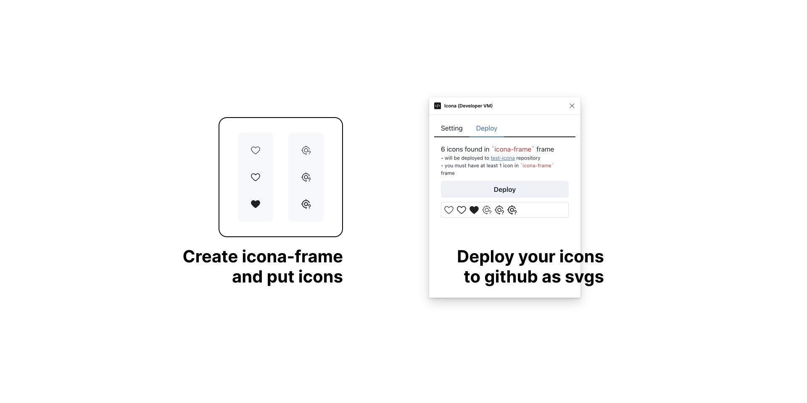
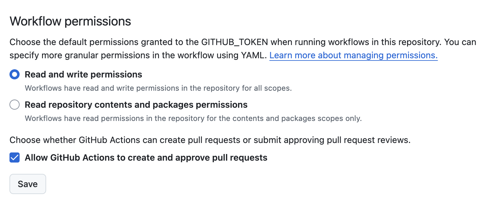

# Icona

> You can export Figma SVG files to GitHub with only one click.

- [How and why Icona came to be: en](https://junghyeonsu.com/en/posts/quickly-apply-icons-that-exist-in-figma-to-your-dev-team/)
- [How and why Icona came to be: ko](https://junghyeonsu.com/posts/quickly-apply-icons-that-exist-in-figma-to-your-dev-team/)

This is a Figma plugin to export SVG files to GitHub with only one click.
Shorten the process between designers (Figma) and developers (GitHub).

- **Designer**: Build icon set in Figma and click deploy button, that's it.
- **Developer**: Check the PR and use the icon svg set in your project. (Make react component, Make Pdf, Make XML, ...etc)

## Boilerplate

- [junghyeonsu/icona-boilerplate](https://github.com/junghyeonsu/icona-boilerplate)

## Preview



## Setting

We need github repository url, github api token


1. **Repository URL**: GitHub repository full url.
2. **Github API Key**: GitHub API Key

API Key need `repo`, `workflow` scope.


If you use `Fine-grained personal access tokens`, you need `contents`, `pull requests`, `metadata` scope.


## How to use

> Assuming you're done setting.

### Designers

1. Install [Icona figma-plugin](https://www.figma.com/community/plugin/1246320822364150095) in Figma.
2. Create a new file in Figma and draw icons in frame named `icona-frame` (convention).
3. Fill icons in `icona-frame` frame and Deploy it.
4. Check the PR and merge it.

### Developers

Icona plugin exports only one file that `icons.json` file in `.icona` folder.
I thought it would be inefficient for the figma plugin to make too many API requests to github,
so I created a library that only sends one file to github and allows developers to create various assets(react component, pdf, xml, ...etc) with that file using `@icona/generator` library.

5. Install `@icona/generator` library in your project.

```bash
yarn add -D @icona/generator
```

6. Create build file with `@icona/generator` library.

   - You can see example in [here (seed-icon)](https://github.com/daangn/seed-icon/blob/main/icona.js)
   - You can see `@icona/generator` library api in [here](https://github.com/daangn/icona/tree/main/packages/icona-generator)

7. Run build script. (ex: `node icona.js`)
8. That's it. You can deploy it or use it in your project.

## Auto Generate (Github Action)

If you want to automate the process of generating assets when PR uploaded, you can use github action.

- [Example](https://github.com/daangn/seed-icon/blob/main/.github/workflows/icona-generate-svg-files.yml)

Then you can use the generated assets that are automatically generated in the PR.

! IMPORTANT

you have to set workflow allow write and create PR in your repository.



## Products

- [figma-plugin (Figma Plugin)](https://github.com/daangn/icona/tree/main/packages/figma-plugin)
- [@icona/generator (Asset Generator)](https://github.com/daangn/icona/tree/main/packages/icona-generator)

## Where use this?

If you use this library, please send PR to add your project in this list.

- [daangn/seed-icon](https://github.com/daangn/seed-icon)

## Common Problems

### 1. If you use `removeAttrs` and remove `id` prop in svgoConfig option, you have to check that exists `<mask>` tag in your svg file.

If the `<mask />` tag is looking at a specific id value as a URL, the mask tag should not delete the id value in the removeAttrs plugin.

If you use `<mask>` tag and using `removeAttrs` plugin in svgoConfig like below...

```html
<svg
  width="24"
  height="24"
  viewBox="0 0 24 24"
  fill="none"
  xmlns="http://www.w3.org/2000/svg"
  data-seed-icon="true"
  data-seed-icon-version="0.5.4"
>
  <g>
    <g>
      <mask id="path-1-inside-1_12571_4011" fill="currentColor">
        <path
          d="..."
          fill="currentColor"
          mask="url(#path-1-inside-1_12571_4011)"
        />
      </mask>
    </g>
  </g>
</svg>
```

The `<mask />` tag must be exception-handled to avoid deleting the id value.

```js
svgoConfig: {
   plugins: [
     {
       name: "removeAttrs",
       params: {
         attrs: ["id"],
       },
       fn: () => {
         return {
           element: {
             enter: node => {
               // NOTE: The `<mask />` tag must be exception-handled to avoid deleting the id value.

               // NOTE: Not working (Maybe bug)
               // if (node.name === 'mask') return;

               // NOTE: Working
               if (node.name !== 'mask') delete node.attributes.id;
             }
           }
         }
       }
     },
   ],
},
```
